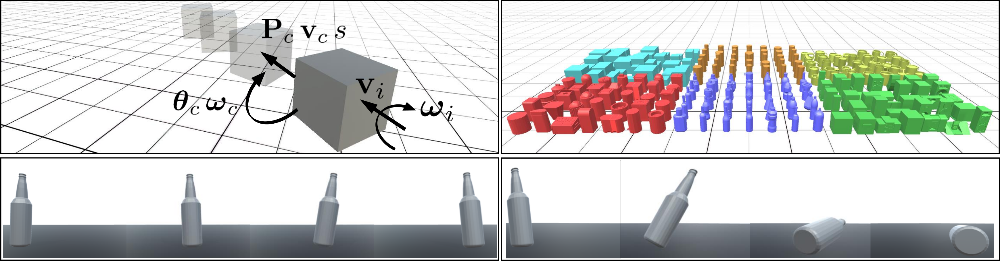

# Predicting the Physical Dynamics of Unseen 3D Objects

## WACV 2020

Davis Rempe, Srinath Sridhar, He Wang, Leonidas J. Guibas



This repository contains the code and dataset used in the paper "Predicting the Physical Dynamics of Unseen 3D Objects" presented at WACV 2020. See the [project page](https://geometry.stanford.edu/projects/learningdynamicsWACV2020/) for more details.

## Setup
This code has been tested on Ubuntu 16.04 using Python 2.7 and Tensorflow 1.13.1 with CUDA 10.0. After installing CUDA, all dependencies can be installed from the root of this repo with:

`pip install -r requirements.txt`

### Downloads
In order to run the code, you must download and place a few things in the repo:
* **All simulated data** can be downloaded from [here](https://drive.google.com/open?id=197JIPbeJFtNzG75SDnUeWf6euiXdRojt). After unzipping, all data directories should be placed in `data/sim/`. For more information on data see [the readme](data).
* Pre-trained PointNet weights that we use to initialize training can be downloaded [here](https://drive.google.com/file/d/1R8EK4EMlEGM6hMn5U9v17mheP52mTzeD/view?usp=sharing) and should be placed in the `pretrained` directory. 
* If you want to visualize results, you will need to download the shape meshes [here](https://drive.google.com/open?id=1YWrgi6Uw7G0jqVu36BvJETjWcXGe0DaM). They should be placed in `viz_unity/DataIn`.

## Structure
Data explanation and example configs.

Unity project.

## Running
Below are directions to train, test, and visualize results from our method.

### Training and Testing
Train command.

`python scripts/train/topple_aa_train_classify.py @./data/configs/Cube5k.train.cfg`

Test command.

`python scripts/test/topple_aa_test_classify.py @./data/configs/Cube5k.test.cfg`

If you run into issues with pickle, may need to regenerate some preprocessing done on the data. For example for the cube data run:

`python scripts/data/calc_normalization_info.py --data_list ./data/sim/dataset_lists/Cube5k/all.txt --info_out ./data/sim/normalization_info/cube_5k.pkl`

### Visualization
For visualizing predicted trajectories, we use the [Unity game engine](https://unity.com/). We have tested our Unity project on version 2017.3.1f1 on Windows 10, but it is a small project and should work in other versions. The visualization is meant to be run on output predictions from the test script using the `--output_pred` flag. To visualize results, place the [required meshes](https://drive.google.com/open?id=1YWrgi6Uw7G0jqVu36BvJETjWcXGe0DaM) in `viz_unity/DataIn`.

After installing Unity, open the project (with base directory at `viz_unity/VizPredictions`) and in the editor double-click to open `Scenes/TumbleVizPred`. To run the visualization script:
* Click the `PredictionVisualizer` object in the Hierarchy panel to view all options for visualization in the Inspector panel.
* Make sure that `Pred Data Dirs` has at least one element which points to the output directory of the test script (i.e., `pred_out`). Increase the size and add more paths if visualizing outputs from multiple directories.
* Make sure `Mesh Sources` has at least one element and points to the directory containing the meshes to use for visualization (i.e., `Cubes/CubeAll`. If visualizing results for the combined dataset, every object category should be added as a mesh source.
* Set `Data Out Dir` path which is where the rendered frames of each prediction will be saved.
* Change any other desired options; the tooltips explain what each option does.
* Make sure `BUILD_MODE` is __not__ checked if running within the Unity Editor.
* Click the play button.

The program will load in each predicted and ground truth trajectory, visualize them, and save the rendered frames.

## Citation

If you use this code, please cite our work:
```latex
@inproceedings{RempeDynamics2020,
	author={Rempe, Davis and Sridhar, Srinath and Wang, He and Guibas, Leonidas J.},
	title={Predicting the Physical Dynamics of Unseen 3D Objects},
	journal={Proceedings of the Winter Conference on Applications of Computer Vision (WACV)},
	year={2020}
}
```
